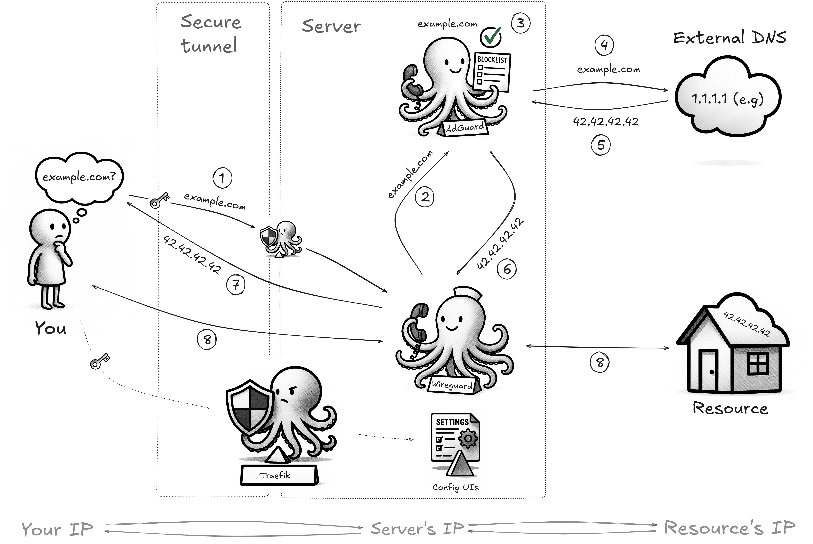

# Self-Hosted WireGuard VPN with Traefik and AdGuard Home

A self-hosted WireGuard VPN with a web UI, ad-blocking, and automatic HTTPS via Traefik. Adapted and inspired by [wg-easy](https://github.com/wg-easy/wg-easy).

## Overview


_A high-level overview of the project architecture. (Image Credit: Diagram by ernvk23)_

## Features

- **Simple Management**: Web UI for adding, removing, and managing VPN clients.
- **Automatic HTTPS**: Traefik provides SSL certificates from Let's Encrypt.
- **Ad Blocking**: AdGuard Home filters ads and trackers for all connected clients.
- **Secure Access**: Web UIs are protected by Basic Authentication.
- **Automated Maintenance**: Optional weekly system updates.
- **Rate Limiting**: Optional UDP port rate-limiting for enhanced security.
- **Simple Setup**: Get running with a single interactive setup script.

## Prerequisites

- A Linux server (**RHEL-based**, **_tested on AlmaLinux 9.6_**) with a public IP.
- A domain name pointing to your server's IP.
- `curl` and `tar` installed.

## Setup

1. **Quick run:**

    ```shell
    mkdir -p ~/wg-lite-hop && cd ~/wg-lite-hop && curl -L https://github.com/ernvk23/wg-lite-hop/archive/refs/heads/main.tar.gz | tar --strip-components=1 -xz --warning=none && chmod +x ./scripts/setup.sh && sudo ./scripts/setup.sh
    ```

2. **Enjoy!**

> [!NOTE]
> This script interactively guides you through configuring WireGuard, Traefik, and AdGuard Home. It installs Docker and `firewalld`, configures firewall rules, optimizes system settings, creates necessary configuration files (including `.env`), and optionally sets up automated weekly system updates and reboots.

## Access

**Access to the web UIs is protected by a two-step process:**

- **Traefik Basic Auth**: For `https://traefik.your_domain` (Traefik Dashboard) and the initial popup for all UIs, use the username and password you set for "Web UI Authentication" during the interactive setup.

- **WireGuard UI**: For `https://your_domain` (Manage VPN clients), use the username and password you set for "WireGuard UI Admin" during the interactive setup.

> [!NOTE]
> After the script completes, please wait approximately 1 minute for WireGuard to properly initialize before attempting to access its UI.

- **AdGuard Home UI**: For `https://adguard.your_domain` (Configure ad-blocking), access is configured via the AdGuard Home setup wizard.

> [!WARNING]
> During AdGuard Home setup, set the **Admin Web Interface Port** to **3000**. Reload the page if the UI appears unresponsive.

> If you accidentally use port 80, manually edit `docker-compose.yml` (change `server.port=3000` to `server.port=80` for `adguard` service) and restart with `sudo docker compose up -d`.

## Usage

Connect to the WireGuard VPN using a client (refer to the WireGuard web UI for configuration). Once connected, your internet traffic will be routed through the VPN, and DNS queries will be filtered by AdGuard Home.

## Maintenance

The automated maintenance system (if enabled) runs weekly, updates system packages, and reboots if necessary. Logs are in `~/update.log`.

## Uninstall

The uninstall script removes the entire stack and its data from your server.

> [!CAUTION]
> This script permanently removes all components, data, firewall rules, and maintenance setups. It will ask for confirmation and offers to back up `.env` and `acme.json`.

To run the uninstaller, execute the following command from the project directory:

```shell
cd ~/wg-lite-hop && chmod +x ./scripts/uninstall.sh && sudo ./scripts/uninstall.sh
```

## Optional

### Force DNS Resolution to Prevent Leaks

To prevent DNS leaks from devices with fixed IPs (which can bypass the VPN's DNS and ad-blocking), force all DNS queries through AdGuard.

1. In the WireGuard Web UI, go to the **Hooks** tab and replace the content with:

    **_PostUp_**

    ```shell
    iptables -A INPUT -p udp -m udp --dport {{port}} -j ACCEPT; ip6tables -A INPUT -p udp -m udp --dport {{port}} -j ACCEPT; iptables -t nat -A PREROUTING -i wg0 -p udp --dport 53 -j DNAT --to-destination 10.42.42.43; iptables -t nat -A PREROUTING -i wg0 -p tcp --dport 53 -j DNAT --to-destination 10.42.42.43; ip6tables -t nat -A PREROUTING -i wg0 -p udp --dport 53 -j DNAT --to-destination fdcc:ad94:bacf:61a3::2b; ip6tables -t nat -A PREROUTING -i wg0 -p tcp --dport 53 -j DNAT --to-destination fdcc:ad94:bacf:61a3::2b; iptables -A FORWARD -i wg0 -j ACCEPT; iptables -A FORWARD -o wg0 -j ACCEPT; ip6tables -A FORWARD -i wg0 -j ACCEPT; ip6tables -A FORWARD -o wg0 -j ACCEPT; iptables -t nat -A POSTROUTING -s {{ipv4Cidr}} -o {{device}} -j MASQUERADE; ip6tables -t nat -A POSTROUTING -s {{ipv6Cidr}} -o {{device}} -j MASQUERADE;
    ```

    **_PostDown_**

    ```shell
    iptables -D INPUT -p udp -m udp --dport {{port}} -j ACCEPT || true; ip6tables -D INPUT -p udp -m udp --dport {{port}} -j ACCEPT || true; iptables -t nat -D PREROUTING -i wg0 -p udp --dport 53 -j DNAT --to-destination 10.42.42.43 || true; iptables -t nat -D PREROUTING -i wg0 -p tcp --dport 53 -j DNAT --to-destination 10.42.42.43 || true; ip6tables -t nat -D PREROUTING -i wg0 -p udp --dport 53 -j DNAT --to-destination fdcc:ad94:bacf:61a3::2b || true; ip6tables -t nat -D PREROUTING -i wg0 -p tcp --dport 53 -j DNAT --to-destination fdcc:ad94:bacf:61a3::2b || true; iptables -D FORWARD -i wg0 -j ACCEPT || true; iptables -D FORWARD -o wg0 -j ACCEPT || true; ip6tables -D FORWARD -i wg0 -j ACCEPT || true; ip6tables -D FORWARD -o wg0 -j ACCEPT || true; iptables -t nat -D POSTROUTING -s {{ipv4Cidr}} -o {{device}} -j MASQUERADE || true; ip6tables -t nat -D POSTROUTING -s {{ipv6Cidr}} -o {{device}} -j MASQUERADE || true;
    ```

2. **Save** and then restart the container with `sudo docker restart wg-easy`

### Rate-Limiting UDP Port (+ Force DNS Resolution)

To enhance security and prevent abuse, you can rate-limit UDP traffic on the WireGuard port. This is an extension of the "Force DNS Resolution" setup, applying rate limits to the UDP port used by WireGuard.

1. In the WireGuard Web UI, go to the **Hooks** tab and replace the content with:

    > The default rate limit is `30000req/sec` with a burst of `60000` (Modify if needed)

    **_PostUp_**

    ```shell
    iptables -N WG_RATELIMIT_V4; iptables -F WG_RATELIMIT_V4; iptables -A WG_RATELIMIT_V4 -m hashlimit --hashlimit-name wg-ratelimit-v4 --hashlimit-mode srcip --hashlimit-upto 30000/second --hashlimit-burst 60000 -j ACCEPT; iptables -A WG_RATELIMIT_V4 -j DROP; ip6tables -N WG_RATELIMIT_V6; ip6tables -F WG_RATELIMIT_V6; ip6tables -A WG_RATELIMIT_V6 -m hashlimit --hashlimit-name wg-ratelimit-v6 --hashlimit-mode srcip --hashlimit-upto 30000/second --hashlimit-burst 60000 -j ACCEPT; ip6tables -A WG_RATELIMIT_V6 -j DROP; iptables -A INPUT -p udp -m udp --dport {{port}} -j WG_RATELIMIT_V4; ip6tables -A INPUT -p udp -m udp --dport {{port}} -j WG_RATELIMIT_V6; iptables -t nat -A PREROUTING -i wg0 -p udp --dport 53 -j DNAT --to-destination 10.42.42.43; iptables -t nat -A PREROUTING -i wg0 -p tcp --dport 53 -j DNAT --to-destination 10.42.42.43; ip6tables -t nat -A PREROUTING -i wg0 -p udp --dport 53 -j DNAT --to-destination fdcc:ad94:bacf:61a3::2b; ip6tables -t nat -A PREROUTING -i wg0 -p tcp --dport 53 -j DNAT --to-destination fdcc:ad94:bacf:61a3::2b; iptables -A FORWARD -i wg0 -j ACCEPT; iptables -A FORWARD -o wg0 -j ACCEPT; ip6tables -A FORWARD -i wg0 -j ACCEPT; ip6tables -A FORWARD -o wg0 -j ACCEPT; iptables -t nat -A POSTROUTING -s {{ipv4Cidr}} -o {{device}} -j MASQUERADE; ip6tables -t nat -A POSTROUTING -s {{ipv6Cidr}} -o {{device}} -j MASQUERADE;
    ```

    **_PostDown_**

    ```shell
    iptables -D INPUT -p udp -m udp --dport {{port}} -j WG_RATELIMIT_V4 || true; iptables -F WG_RATELIMIT_V4 || true; iptables -X WG_RATELIMIT_V4 || true; ip6tables -D INPUT -p udp -m udp --dport {{port}} -j WG_RATELIMIT_V6 || true; ip6tables -F WG_RATELIMIT_V6 || true; ip6tables -X WG_RATELIMIT_V6 || true; iptables -t nat -D PREROUTING -i wg0 -p udp --dport 53 -j DNAT --to-destination 10.42.42.43 || true; iptables -t nat -D PREROUTING -i wg0 -p tcp --dport 53 -j DNAT --to-destination 10.42.42.43 || true; ip6tables -t nat -D PREROUTING -i wg0 -p udp --dport 53 -j DNAT --to-destination fdcc:ad94:bacf:61a3::2b || true; ip6tables -t nat -D PREROUTING -i wg0 -p tcp --dport 53 -j DNAT --to-destination fdcc:ad94:bacf:61a3::2b || true; iptables -D FORWARD -i wg0 -j ACCEPT || true; iptables -D FORWARD -o wg0 -j ACCEPT || true; ip6tables -D FORWARD -i wg0 -j ACCEPT || true; ip6tables -D FORWARD -o wg0 -j ACCEPT || true; iptables -t nat -D POSTROUTING -s {{ipv4Cidr}} -o {{device}} -j MASQUERADE || true; ip6tables -t nat -D POSTROUTING -s {{ipv6Cidr}} -o {{device}} -j MASQUERADE || true;
    ```

2. **Save** and then restart the container with `sudo docker restart wg-easy`

### AdGuard Home Configuration Notes

AdGuard Home is managed via its web UI. While it has basic filters, these are customizable. The provided [`AdGuardHome.yaml`](./assets/AdGuardHome.yaml) offers advanced DNS settings and filters for reference, but cannot replace the active configuration.

## Licensing

This project is released under the [GNU Affero General Public License v3](LICENSE)
