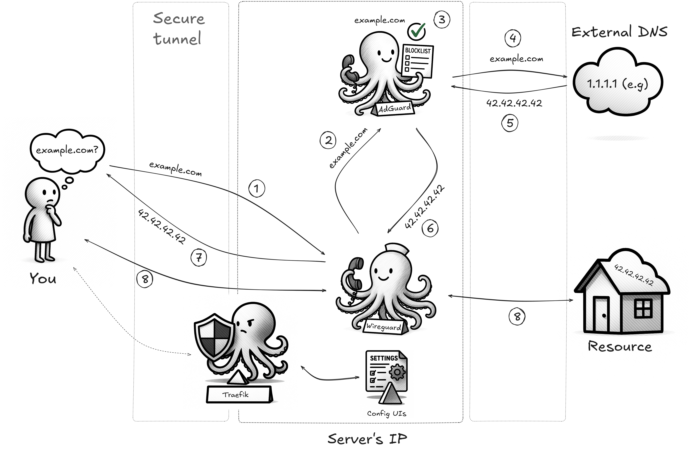

# Easy WireGuard VPN with Traefik and AdGuard Home

A self-hosted WireGuard VPN with a web-based management UI, ad-blocking, and automatic HTTPS via Traefik. This project is inspired by and adapted from [wg-easy](https://github.com/wg-easy/wg-easy).

## Overview


*A high-level overview of the project architecture. (Image Credit: Diagram by ernvk23)*

## Features

*   **Easy WireGuard Management**: Simple web UI to add, remove, and manage VPN clients.
*   **Automatic HTTPS**: Traefik handles SSL/TLS certificates from Let's Encrypt automatically.
*   **Network-wide Ad Blocking**: Integrated AdGuard Home filters out ads and trackers for all VPN clients.
*   **Secure Access**: Web UIs are protected by Basic Authentication.
*   **Automated Maintenance**: Weekly system updates and Docker container management with automatic reboots when needed.
*   **Simple Setup**: Get up and running with a single setup script and `docker compose`.

## Prerequisites

*   A Linux server with a public IP address and a RHEL-compatible distribution installed.
    *   **Tested on: AlmaLinux 9.6**
*   A domain name pointing to your server's IP address.
*   `curl` and `tar` installed.

## Setup

1. **Quick Install & Setup (AlmaLinux/RHEL):**

    ```bash
    curl -L https://github.com/ernvk23/wg-lite-hop/archive/refs/heads/main.tar.gz | tar xz && cd wg-lite-hop-main && chmod +x setup.sh && sudo ./setup.sh
    ```
    This script will:
    *   Verify your system is RHEL-based.
    *   Install Docker and `firewalld` if they are not already present.
    *   Configure necessary firewall rules (ports 80, 443, and 51820).
    *   Create essential directories and configuration files, including Traefik's SSL certificates (`acme.json`) and AdGuard Home volumes.
    *   Generate a `.env` file for your custom settings.

2.  **Modify the `.env` file:**

    Edit the `.env` file to set your actual domain, email, and a strong password hash (as instructed by the setup script).

3.  **Start the services:**

    ```bash
    sudo docker compose up -d
    ```

4.  **Set up automated maintenance (optional but recommended):**

    ```bash
    chmod +x scripts/add_update_cron.sh && ./scripts/add_update_cron.sh
    ```

    This sets up:
    - Weekly system updates every Monday at 2 AM
    - Automatic Docker image updates
    - Automatic reboots when system updates require them
    - Post-reboot container restart

## Access

*   WireGuard Web UI (to set up clients): `https://your_domain`
*   AdGuard Home UI (configure ad/trackers block lists): `https://adguard.your_domain`
    > **⚠️ Important:** During the initial AdGuard Home setup, ensure you explicitly set the web interface port to `3000`. After completing the setup process, if the AdGuard Home UI appears to be stuck or unresponsive, this is expected. Simply reload the page, and the panel will display correctly. Do not use the default port `80` offered by the UI, as this will require manual intervention to adjust the `docker-compose.yml` configuration.
*   Traefik Dashboard UI (check server's metrics, *optional*): `https://traefik.your_domain`

Use the credentials defined in your `.env` file to access the web UIs. 
*Note:* When accessing the web UIs, your browser will first show a pop-up asking for a username and password. This is the basic authentication layer provided by Traefik. Use the `AUTH_USER` from your `.env` file and the password you used to generate the `AUTH_PASS_HASH` value.

## Usage

1.  Connect to the WireGuard VPN using a client (see the WireGuard web UI for configuration).
2.  Your internet traffic will now be routed through the VPN, and DNS queries will be filtered by AdGuard Home.

## Maintenance

The automated maintenance system (if enabled) will:
- Run weekly on Mondays at 2 AM
- Update system packages using `dnf update -y`
- Pull latest Docker images and restart containers
- Reboot the server if system updates require it
- Automatically restart containers after reboot

Logs are stored in `~/update.log` for monitoring maintenance activities.

## Uninstall

To completely remove the `wg-lite-hop` stack and all its data from your server, you can use the provided uninstall script.

> **Warning: This is a destructive operation.** This script will permanently remove all components of the `wg-lite-hop` stack, including:
> *   All Docker containers, images, and associated data (WireGuard client configurations, AdGuard Home settings).
> *   Firewall rules opened during setup.
> *   The project directory and all its configuration files.
> *   Any automated maintenance setup (cron jobs and sudoers rules).
>
> The script will ask for confirmation before proceeding. It also offers to back up your `.env` and Traefik's SSL certificates (`acme.json`) files to your home directory.
> 
> To run the uninstaller, execute the following command from within the project directory. The script will ask for final confirmation before deleting anything.
```bash
chmod +x uninstall.sh && sudo ./uninstall.sh
```

## Licensing

This project is released under the [GNU Affero General Public License v3](LICENSE)
